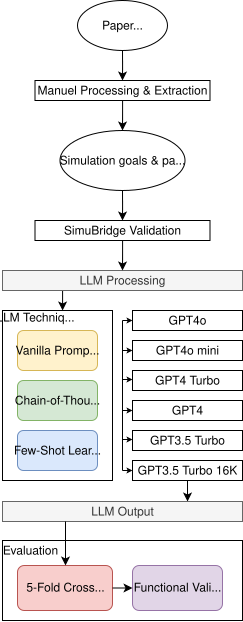

# From Simulation Goals to Parameters - A Hybrid Approach Combining Literature, Simulation and Large Language Models

This repository contains the source code for the research tool described in the Master's thesis of the same name.

## Abstract

Business Process Simulation (BPS) provides a powerful means for analyzing and optimizing operational processes, but configuring simulation models to reflect specific business goals remains challenging for non-expert stakeholders. This thesis investigates how Large Language Models (LLMs) can bridge the gap between high-level simulation goals and technical parameter configurations. By combining insights from literature review, validation through simulation experiments, and LLM integration, this work develops a conversational interface that translates natural language business objectives into actionable simulation parameters. The approach makes BPS tools more accessible to managers and product owners who lack deep technical knowledge about simulation parameters and their effects on desired process outcomes.

## Overview

The Goal-to-Parameter Translator is a Next.js-based research tool designed to help users translate business process simulation goals into technical simulation parameters. The system provides an intuitive chat interface where stakeholders can describe their business objectives in natural language and receive parameter suggestions powered by OpenAI's language models.

## System Architecture



## Features

- Translates business goals into simulation parameters using multiple OpenAI models (GPT-4o, GPT-4 Turbo, GPT-3.5 Turbo)
- Conversational interface with conversation history preservation
- Customizable system prompts with management interface
- Single active prompt enforcement for consistent responses
- Integration with simulation parameter knowledge base from literature review

## Requirements

- Docker and Docker Compose
- OpenAI API account (costs may apply based on usage)

## Installation

Clone the repository:

```bash
git clone https://github.com/yourusername/from-simulation-goals-to-parameters.git
cd from-simulation-goals-to-parameters
```

Set up the necessary environment variables by creating a .env file in the project root directory:

```bash
cp .env.example .env
```

Or simply create a `.env` file and add your OpenAI API key:

```bash
OPENAI_API_KEY=your_openai_api_key_here
```

**Important**: Get your API key from https://platform.openai.com/api-keys (costs may apply based on usage)

Start the application:

```bash
docker-compose up --build
```

Access the application:

Open http://localhost:3000 in your browser

The application will automatically start PostgreSQL database, build the Next.js application, run database migrations, and launch the web server.

## Usage

### Web Interface

Navigate to http://localhost:3000 and:

- Main Chat Interface: Describe your business process and improvement goals in natural language
- Model Selection: Choose from available OpenAI models (GPT-4o, GPT-4 Turbo, GPT-3.5 Turbo) in the dropdown menu
- Prompt Management: Access the "Manage Prompts" page to create and manage system prompts
- Single Active Prompt: Only one system prompt can be active at a time for consistent responses

### Example

```
User: "I want to reduce waiting times in our customer service process while maintaining quality"

System: Based on your goal to reduce waiting times while maintaining quality in customer service, here are the relevant simulation parameters to consider:

1. Resource Allocation:
   - Increase the number of customer service representatives
   - Parameter: resource_count = 5-8 (current + 2-3 additional staff)

2. Service Time Distribution:
   - Optimize service time without compromising quality
   - Parameter: service_time = triangular(3, 5, 8) minutes

3. Queue Management:
   - Implement priority queuing for different customer types
   - Parameter: routing_probability = 0.7 (high priority), 0.3 (standard)
```

## Input Data

The system integrates with simulation parameter data from literature review:
- `data/ParametersToGoalsTable.csv`: Contains documented relationships between simulation goals and parameters

## Output

The application provides:
- Interactive conversational responses with parameter suggestions
- Model-specific recommendations based on selected OpenAI model
- Conversation history for context-aware follow-up questions
- Customizable system prompts for different use cases

## Structure of this Repository

### Code Files
- `src/app/page.tsx`: Main chat interface component
- `src/app/prompts/page.tsx`: Prompt management interface
- `src/app/api/chat/route.ts`: OpenAI integration endpoint
- `src/app/api/prompts/`: Prompt CRUD API endpoints
- `src/lib/prisma.ts`: Database configuration
- `src/components/ui/`: shadcn/ui component library

### Data Files
- `data/ParametersToGoalsTable.csv`: Literature-based goal-parameter relationships
- `prisma/schema.prisma`: Database schema definition
- `docker-compose.yml`: PostgreSQL container configuration

### Configuration Files
- `.env`: Environment variables (create from template)
- `package.json`: Node.js dependencies and scripts
- `tailwind.config.ts`: Tailwind CSS configuration

## License

This project is developed for academic purposes as part of a Master's thesis at Technical University of Munich.

## Contact

For any questions or issues, please contact Mürüvet Gökçen Doganay (ge45den@tum.de).
